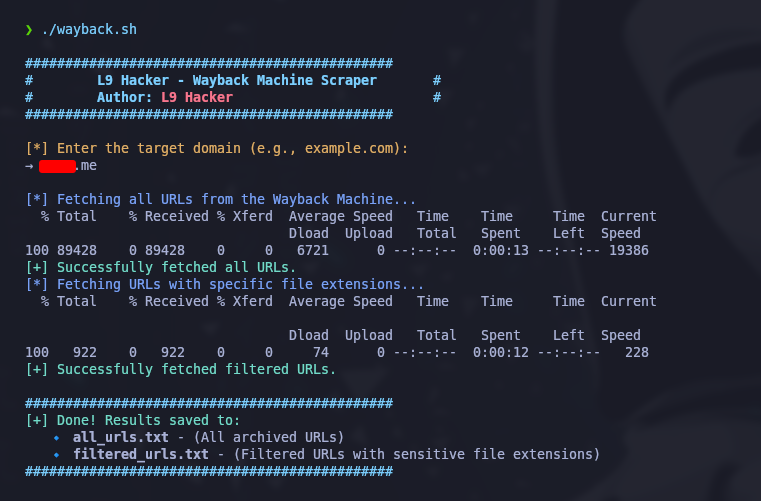

# Wayback Machine Scraper

## 📌 About
**Wayback Machine Scraper** is a Bash script that scrapes archived URLs from the **Wayback Machine (Archive.org)**. This tool is useful for **bug bounty hunters, penetration testers, and OSINT researchers** to find hidden or sensitive files that were once publicly available.

## 🚀 Features
- **Fetch all archived URLs** for a given domain.
- **Filter URLs** containing sensitive file extensions (e.g., `.sql`, `.json`, `.zip`, `.env`, etc.).
- **Color-coded terminal output** for better readability.
- **Error handling** for failed requests.
- **Simple and lightweight** – only requires `curl`.

## 📂 Installation
### **1️⃣ Clone the Repository**
```bash
git clone https://github.com/L9-Hacker/wayback-scraper.git
cd wayback-scraper
```

### **2️⃣ Make the Script Executable**
```bash
chmod +x wayback-scraper.sh
```

## 🛠️ Usage
### **Basic Usage**
```bash
./wayback-scraper.sh
```
- Enter the target domain (e.g., `example.com`)
- The script will fetch all archived URLs and filter those with sensitive file extensions.

### **Output Files**
- **`all_urls.txt`** → Contains all archived URLs.
- **`filtered_urls.txt`** → Contains URLs with sensitive file extensions.

### **Example Screenshot**
  

## 🔥 Supported File Extensions
The script extracts URLs containing the following file types:
```txt
xls, xml, xlsx, json, pdf, sql, doc, docx, pptx, txt, git, zip, tar.gz, tgz,
bak, 7z, rar, log, cache, secret, db, backup, yml, gz, config, csv, yaml,
md, md5, exe, dll, bin, ini, bat, sh, tar, deb, rpm, iso, img, env, apk,
msi, dmg, tmp, crt, pem, key, pub, asc
```

## 📌 Future Improvements
✅ Add multithreading for faster scraping.
✅ Implement a progress bar.
✅ Allow domain list input for bulk scanning.
✅ Save results in a structured directory.

## ⚠️ Disclaimer
This tool is meant for **educational and security research purposes only**. Do not use it for **unauthorized** activities. The author is not responsible for any misuse of this tool.

## ⭐ Star This Project
If you find this tool useful, **give it a ⭐ on GitHub!** 🚀

